# Ableton MCP Server - Architecture & Development Guide

> Complete technical documentation for understanding, extending, and debugging the Ableton Live MCP Server

## Table of Contents

1. [Architecture Overview](#1-architecture-overview)
2. [Clean Architecture Layers](#2-clean-architecture-layers)
3. [Design Patterns](#3-design-patterns)
4. [Sequence Diagrams](#4-sequence-diagrams)
5. [Adding New Features Guide](#5-adding-new-features-guide)
6. [Bug Hunting & Debugging Guide](#6-bug-hunting--debugging-guide)
7. [AI Context Prompt](#7-ai-context-prompt)

---

## 1. Architecture Overview

### High-Level System Architecture

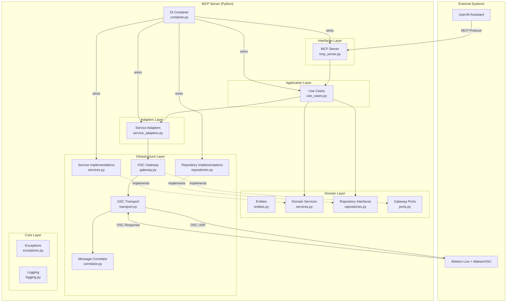

### Directory Structure

```
ableton_mcp/
├── __init__.py              # Package initialization
├── main.py                  # Application entry point
├── container.py             # Dependency Injection container
│
├── core/                    # Cross-cutting concerns
│   ├── __init__.py
│   ├── exceptions.py        # Custom exception hierarchy
│   └── logging.py           # JSON structured logging
│
├── domain/                  # Business entities & contracts
│   ├── __init__.py
│   ├── entities.py          # Song, Track, Clip, Note, etc.
│   ├── repositories.py      # Repository interfaces (ABC)
│   ├── services.py          # Domain service interfaces (ABC)
│   └── ports.py             # Gateway port interface (ABC)
│
├── application/             # Use cases (business logic)
│   ├── __init__.py
│   └── use_cases.py         # All use case classes
│
├── adapters/                # Bridge domain to infrastructure
│   ├── __init__.py
│   └── service_adapters.py  # Ableton service adapters
│
├── infrastructure/          # External implementations
│   ├── __init__.py
│   ├── repositories.py      # In-memory repository implementations
│   ├── services.py          # Music theory, mixing implementations
│   └── osc/                 # OSC communication
│       ├── __init__.py
│       ├── gateway.py       # AbletonOSCGateway implementation
│       ├── transport.py     # AsyncOSCTransport (UDP)
│       └── correlator.py    # Request-response correlation
│
└── interfaces/              # External interfaces
    ├── __init__.py
    └── mcp_server.py        # MCP protocol handler
```

---

## 2. Clean Architecture Layers

### Layer Dependency Rules

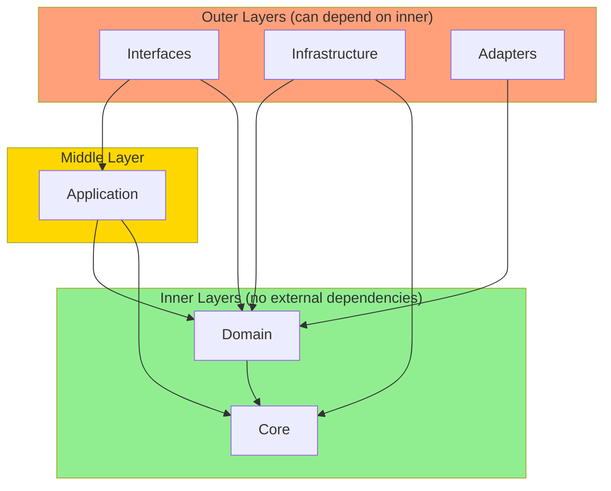

### Layer Responsibilities

| Layer | Responsibility | Key Files |
|-------|---------------|-----------|
| **Interfaces** | Protocol handling, request/response formatting | `mcp_server.py` |
| **Application** | Business logic orchestration, use case execution | `use_cases.py` |
| **Domain** | Business entities, contracts, core business rules | `entities.py`, `services.py`, `repositories.py`, `ports.py` |
| **Adapters** | Bridge domain services to infrastructure | `service_adapters.py` |
| **Infrastructure** | External system implementations (OSC, storage) | `gateway.py`, `repositories.py`, `services.py` |
| **Core** | Cross-cutting concerns (exceptions, logging) | `exceptions.py`, `logging.py` |

### Domain Entities Hierarchy

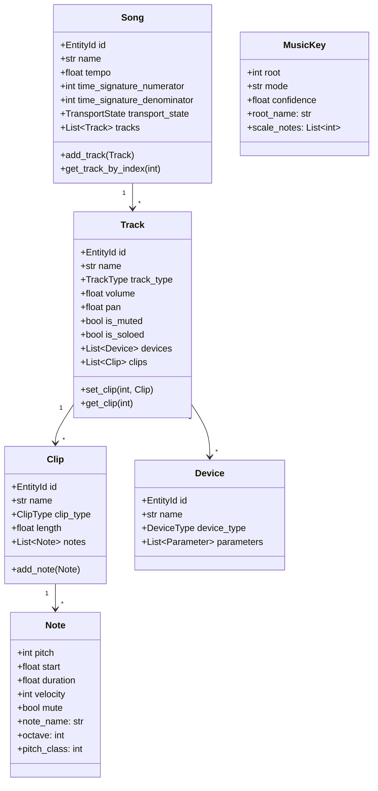

---

## 3. Design Patterns

### 3.1 Use Case Pattern

Each business operation is encapsulated in a dedicated use case class with an `execute()` method.

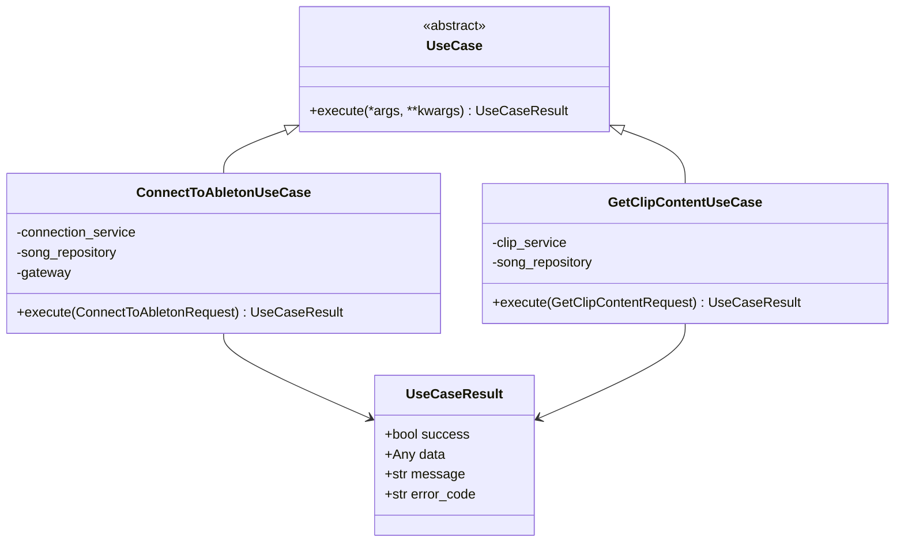

**Pattern Structure:**
```python
@dataclass
class MyRequest:
    """Input DTO for the use case."""
    field1: str
    field2: int = None

class MyUseCase(UseCase):
    def __init__(self, service: SomeService, repository: SomeRepository) -> None:
        self._service = service
        self._repository = repository

    async def execute(self, request: MyRequest) -> UseCaseResult:
        try:
            # Business logic here
            result = await self._service.do_something(request.field1)
            return UseCaseResult(success=True, data=result)
        except DomainError as e:
            return UseCaseResult(success=False, message=str(e), error_code=e.error_code)
```

### 3.2 Repository Pattern

Abstract interfaces define data access contracts; implementations are in infrastructure.

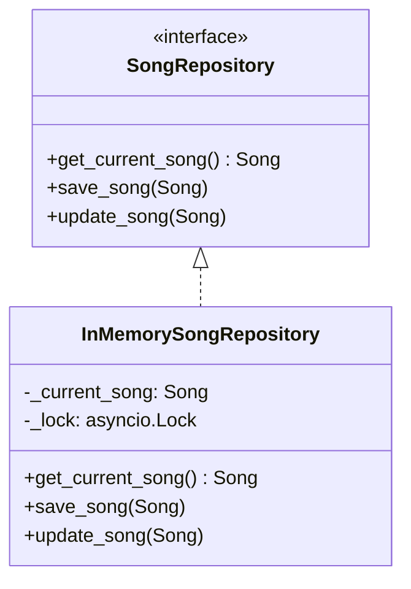

### 3.3 Gateway/Port Pattern

The domain defines what it needs (port); infrastructure provides implementation (adapter).

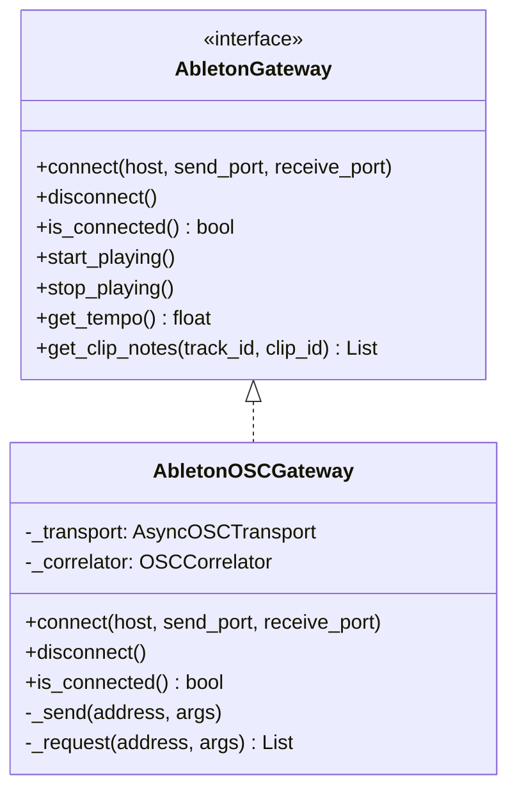

### 3.4 Service Adapter Pattern

Thin wrappers that translate between domain and infrastructure.

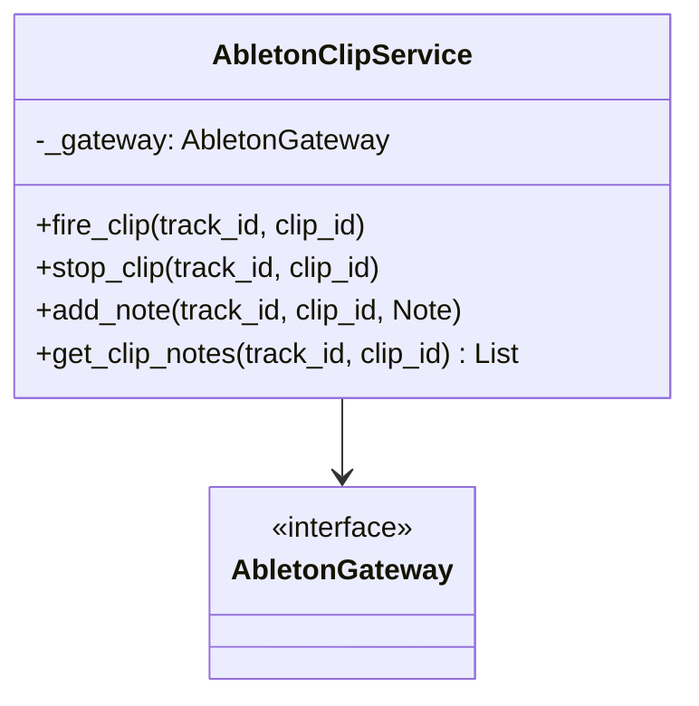

### 3.5 Dependency Injection Pattern

All wiring happens in `container.py` using `dependency-injector`.

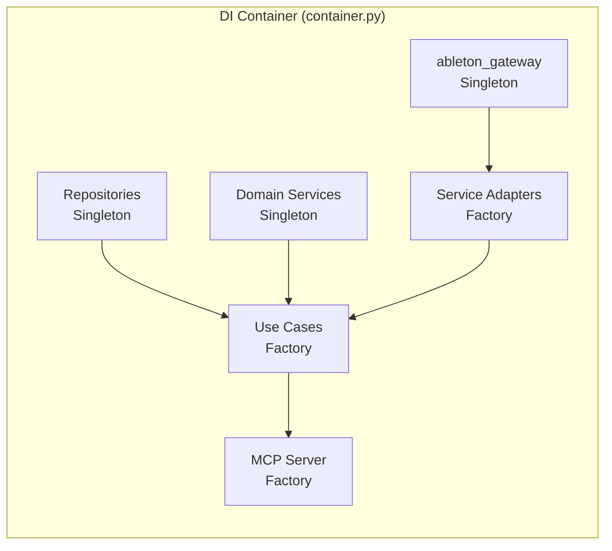

---

## 4. Sequence Diagrams

### 4.1 Connection Sequence

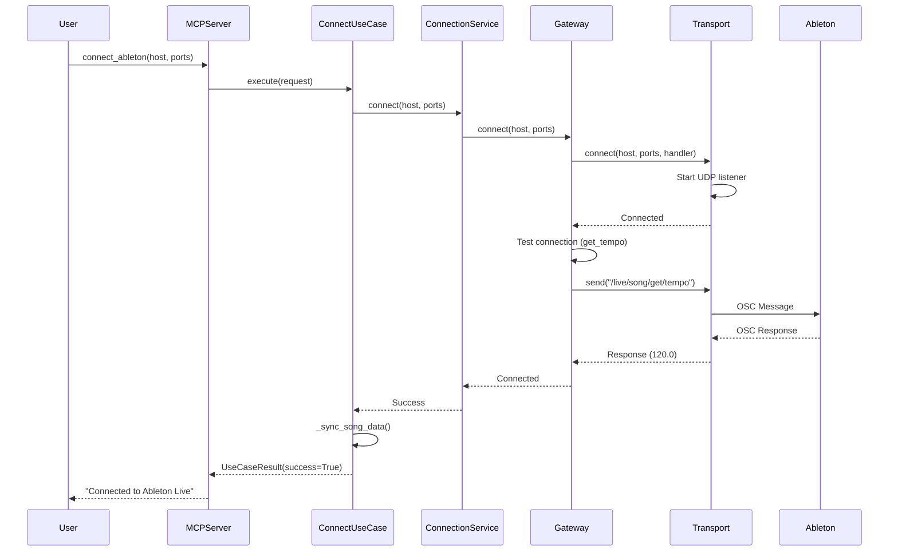

### 4.2 Add Notes Sequence

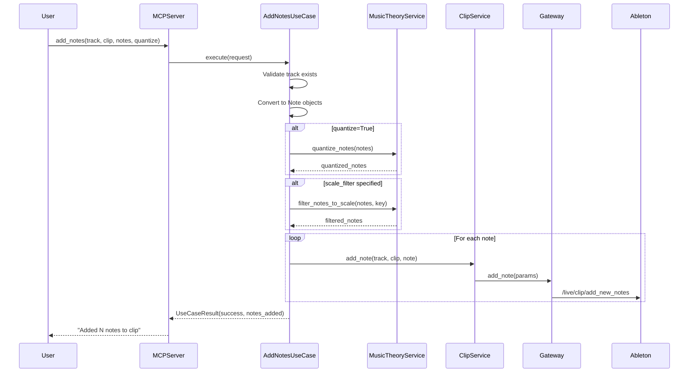

### 4.3 Get Clip Content Sequence

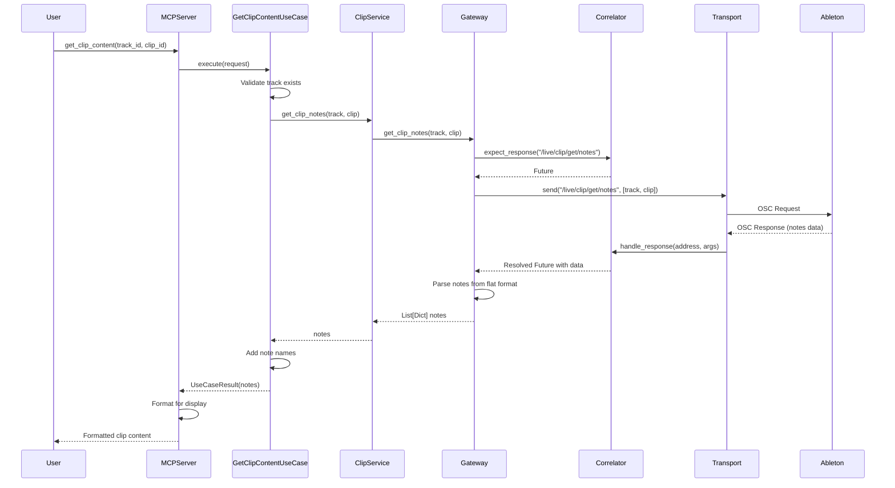

### 4.4 Harmony Analysis Sequence

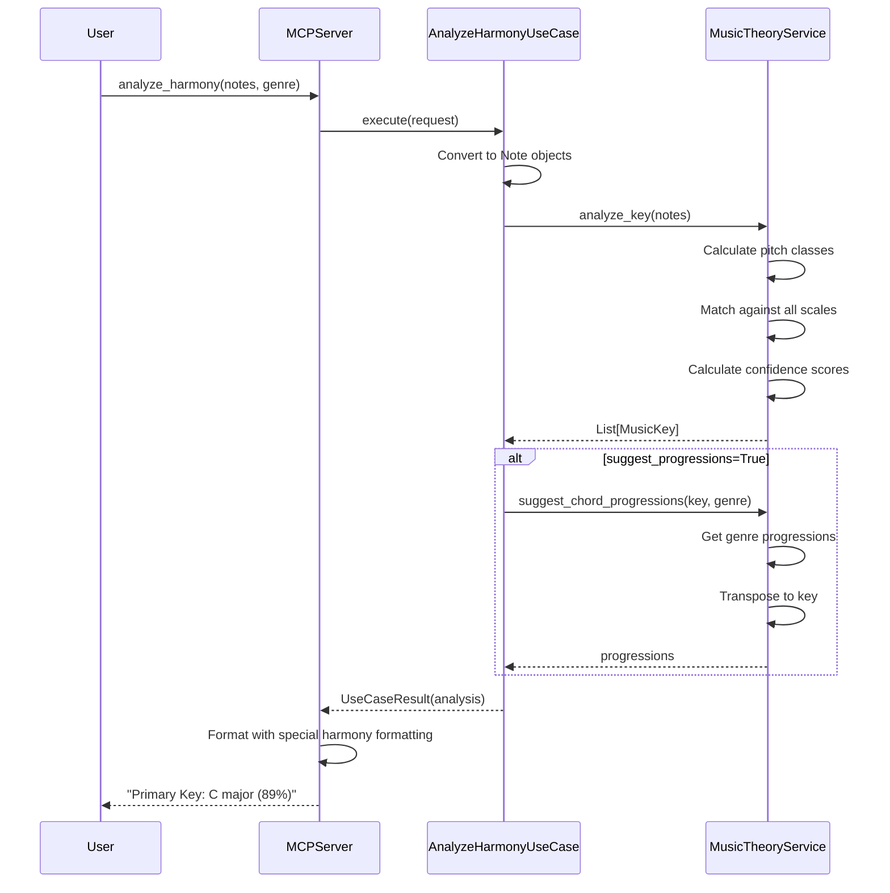

---

## 5. Adding New Features Guide

### Step-by-Step Process

Follow this checklist when adding a new MCP tool or feature:

#### Step 1: Define the Request DTO (use_cases.py)

```python
@dataclass
class MyNewFeatureRequest:
    """Request for my new feature."""
    required_param: str
    optional_param: int = None
```

#### Step 2: Create the Use Case (use_cases.py)

```python
class MyNewFeatureUseCase(UseCase):
    """Use case for my new feature."""

    def __init__(
        self,
        some_service: SomeService,
        song_repository: SongRepository,
    ) -> None:
        self._some_service = some_service
        self._song_repository = song_repository
        self._logger = structlog.get_logger(__name__)

    async def execute(self, request: MyNewFeatureRequest) -> UseCaseResult:
        try:
            self._logger.info(
                "Executing my new feature",
                param=request.required_param,
            )

            # Business logic here
            result = await self._some_service.do_work(request.required_param)

            self._logger.info("Feature completed", result=result)

            return UseCaseResult(
                success=True,
                data={"result": result},
                message="Feature executed successfully",
            )

        except SomeDomainError as e:
            self._logger.warning("Domain error", error=str(e))
            return UseCaseResult(
                success=False,
                message=str(e),
                error_code=e.error_code,
            )
        except Exception as e:
            self._logger.error("Unexpected error", error=str(e))
            return UseCaseResult(
                success=False,
                message=f"Error: {str(e)}",
                error_code="MY_FEATURE_ERROR",
            )
```

#### Step 3: Add Service Adapter Method (if needed) (service_adapters.py)

```python
class AbletonSomeService:
    def __init__(self, gateway: AbletonGateway) -> None:
        self._gateway = gateway

    async def do_work(self, param: str) -> Any:
        """Do work via gateway."""
        return await self._gateway.some_method(param)
```

#### Step 4: Add Gateway Method (if new OSC command) (gateway.py & ports.py)

First, add to the port interface (ports.py):
```python
@abstractmethod
async def some_method(self, param: str) -> Any:
    """Description of what this does."""
    ...
```

Then implement in gateway (gateway.py):
```python
async def some_method(self, param: str) -> Any:
    """Implementation with OSC communication."""
    response = await self._request("/live/some/endpoint", [param])
    return self._parse_response(response)
```

#### Step 5: Wire in DI Container (container.py)

```python
# Import the use case
from ableton_mcp.application.use_cases import MyNewFeatureUseCase

# Add factory provider
my_new_feature_use_case = providers.Factory(
    MyNewFeatureUseCase,
    some_service=some_service,
    song_repository=song_repository,
)

# Add to MCP server factory
mcp_server = providers.Factory(
    AbletonMCPServer,
    # ... existing use cases ...
    my_new_feature_use_case=my_new_feature_use_case,
)
```

#### Step 6: Add MCP Tool Definition (mcp_server.py)

```python
# In __init__, add parameter:
def __init__(
    self,
    # ... existing ...
    my_new_feature_use_case: MyNewFeatureUseCase,
) -> None:
    # ... existing ...
    self._my_new_feature_use_case = my_new_feature_use_case

# In handle_list_tools(), add tool definition:
types.Tool(
    name="my_new_feature",
    description="Description for AI to understand the tool",
    inputSchema={
        "type": "object",
        "properties": {
            "required_param": {
                "type": "string",
                "description": "What this parameter does",
            },
            "optional_param": {
                "type": "integer",
                "description": "Optional parameter description",
            },
        },
        "required": ["required_param"],
    },
),

# In handle_call_tool(), add handler:
elif name == "my_new_feature":
    request = MyNewFeatureRequest(
        required_param=arguments["required_param"],
        optional_param=arguments.get("optional_param"),
    )
    result = await self._my_new_feature_use_case.execute(request)
```

#### Step 7: Add Tests (tests/unit/test_use_cases.py)

```python
class TestMyNewFeatureUseCase:
    async def test_success(self) -> None:
        # Arrange
        mock_service = Mock()
        mock_service.do_work = AsyncMock(return_value="result")
        song_repository = InMemorySongRepository()

        use_case = MyNewFeatureUseCase(mock_service, song_repository)
        request = MyNewFeatureRequest(required_param="test")

        # Act
        result = await use_case.execute(request)

        # Assert
        assert result.success is True
        assert result.data["result"] == "result"
        mock_service.do_work.assert_called_once_with("test")

    async def test_error_handling(self) -> None:
        # Test error cases
        pass
```

#### Step 8: Run Quality Checks

```bash
# Format code
black ableton_mcp/ tests/

# Lint
ruff check ableton_mcp/ tests/

# Type check
mypy ableton_mcp/

# Run tests
pytest tests/unit/ -v
```

---

## 6. Bug Hunting & Debugging Guide

### Common Issue Categories

#### Category 1: OSC Communication Issues

**Symptoms:**
- Connection timeouts
- Commands not executing in Ableton
- No response from Ableton

**Debugging Steps:**

1. **Check AbletonOSC is installed and enabled:**
   - Ableton Preferences > MIDI > Control Surface = AbletonOSC
   - Check Ableton's Log.txt for "AbletonOSC: Listening on port 11000"

2. **Verify ports are available:**
   ```bash
   # Windows
   netstat -an | findstr 11000

   # macOS/Linux
   lsof -i :11000
   ```

3. **Check gateway connection state:**
   ```python
   # In gateway.py, add logging
   logger.debug("Sending OSC", address=address, args=args)
   ```

4. **Verify correlator is receiving responses:**
   ```python
   # In correlator.py
   def handle_response(self, address: str, args: List[Any]) -> None:
       logger.debug("Received response", address=address, args=args)
   ```

**Common Fixes:**
- Increase timeout in `_request()` method
- Add delays between rapid OSC commands
- Restart Ableton to reset OSC script

#### Category 2: Use Case Logic Errors

**Symptoms:**
- Wrong data returned
- Validation errors
- Unexpected behavior

**Debugging Steps:**

1. **Check structured logs:**
   ```bash
   # View recent logs
   tail -f ableton_mcp.log | jq
   ```

2. **Add contextual logging:**
   ```python
   self._logger.debug(
       "Processing request",
       track_id=request.track_id,
       current_song=song.name if song else None,
   )
   ```

3. **Verify request DTOs:**
   ```python
   # Print request contents
   self._logger.info("Request received", request=vars(request))
   ```

#### Category 3: Dependency Injection Issues

**Symptoms:**
- `None` services
- Wrong instances injected
- Missing dependencies

**Debugging Steps:**

1. **Check container wiring:**
   ```python
   # In container.py, verify all dependencies are listed
   my_use_case = providers.Factory(
       MyUseCase,
       service=service,  # Is this defined above?
       repository=repository,  # Is this defined?
   )
   ```

2. **Verify import statements:**
   - Use case imported in container.py?
   - Request DTO imported in mcp_server.py?

3. **Test container resolution:**
   ```python
   container = Container()
   use_case = container.my_use_case()
   print(type(use_case))  # Should show MyUseCase
   ```

#### Category 4: MCP Protocol Issues

**Symptoms:**
- Tool not appearing in AI assistant
- Tool calls failing silently
- Wrong parameter types

**Debugging Steps:**

1. **Verify tool schema:**
   - JSON schema must be valid
   - Required parameters must be in "required" array
   - Types must match MCP expectations

2. **Check handler routing:**
   ```python
   # In handle_call_tool
   logger.info("Tool called", tool=name, arguments=arguments)
   ```

3. **Verify result formatting:**
   ```python
   # Check _format_result is handling your data type
   logger.debug("Formatting result", result_type=type(result.data))
   ```

### Debugging Workflow

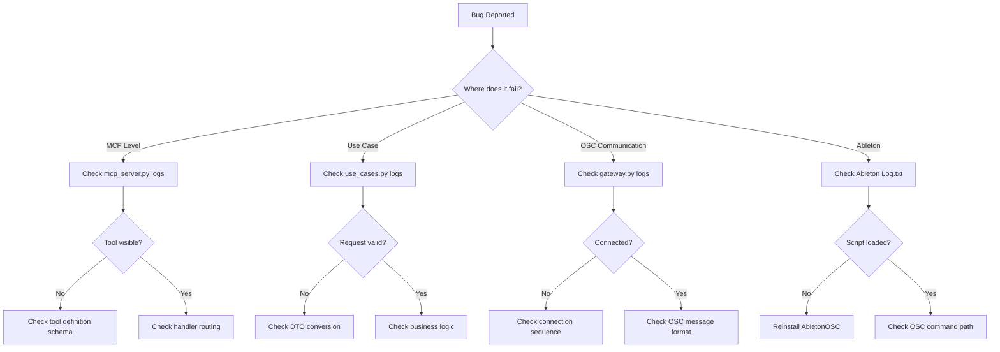

### Log Analysis

The server uses JSON structured logging. Key fields:

| Field | Description |
|-------|-------------|
| `event` | Log message |
| `level` | info, warning, error |
| `logger` | Module name |
| `timestamp` | ISO 8601 timestamp |
| `tool` | MCP tool name (for tool calls) |
| `track_id`, `clip_id` | Context for operations |
| `error` | Error message |
| `error_code` | Exception error code |

**Useful jq queries:**

```bash
# Errors only
cat ableton_mcp.log | jq 'select(.level == "error")'

# Specific tool calls
cat ableton_mcp.log | jq 'select(.tool == "add_notes")'

# Recent errors with context
tail -100 ableton_mcp.log | jq 'select(.level == "error") | {event, error, error_code}'
```

---

## 7. AI Context Prompt

Use this prompt when asking an AI assistant to work on this codebase:

---

### Context Prompt for AI Assistants

```
# Ableton MCP Server - Development Context

## Project Overview
This is a Model Context Protocol (MCP) server that enables AI assistants to control Ableton Live via OSC. It follows Clean Architecture with strict layer separation.

## Architecture Summary
- **Interfaces Layer** (`interfaces/mcp_server.py`): MCP protocol handling, tool definitions
- **Application Layer** (`application/use_cases.py`): Business logic in use case classes
- **Domain Layer** (`domain/`): Entities, repository interfaces, service interfaces, gateway ports
- **Adapters Layer** (`adapters/service_adapters.py`): Bridge domain to infrastructure
- **Infrastructure Layer** (`infrastructure/`): OSC gateway, repository implementations, service implementations
- **Core Layer** (`core/`): Exceptions, logging

## Key Patterns
1. **Use Case Pattern**: Each operation is a class with `execute(Request) -> UseCaseResult`
2. **Repository Pattern**: Abstract interfaces in domain, implementations in infrastructure
3. **Gateway/Port Pattern**: Domain defines contracts (`AbletonGateway`), infrastructure implements (`AbletonOSCGateway`)
4. **Dependency Injection**: All wiring in `container.py` using `dependency-injector`
5. **Request/Response DTOs**: Dataclasses for inputs, `UseCaseResult` for outputs

## When Adding Features
1. Create Request DTO in `use_cases.py`
2. Create UseCase class in `use_cases.py`
3. Add service adapter method if needed (`service_adapters.py`)
4. Add gateway method if new OSC command (`ports.py` interface, `gateway.py` implementation)
5. Wire in DI container (`container.py`)
6. Add tool definition and handler in `mcp_server.py`
7. Add tests in `tests/unit/test_use_cases.py`

## Code Standards
- Python 3.11+ with strict mypy (`disallow_untyped_defs = true`)
- Line length: 100 (black + ruff)
- Pydantic models for domain entities
- Structlog for JSON structured logging
- All use cases must have structured logging for key operations

## OSC Communication
- Default ports: 11000 (send), 11001 (receive)
- Fire-and-forget commands: Use `_send()` method
- Request-response: Use `_request()` method with correlator
- Note format: [pitch, start, duration, velocity, mute] as flat list

## Testing
- pytest with asyncio_mode="auto"
- Mock external dependencies (OSC, services)
- Use `InMemory*Repository` fixtures for repository tests
- Coverage target: 85%

## File Locations for Common Tasks
- Add new MCP tool: `interfaces/mcp_server.py`, `application/use_cases.py`, `container.py`
- Add new OSC command: `domain/ports.py`, `infrastructure/osc/gateway.py`
- Add new entity: `domain/entities.py`
- Add business logic: `application/use_cases.py`, `infrastructure/services.py`
- Fix exception handling: `core/exceptions.py`

## Current MCP Tools
- `connect_ableton`: OSC connection
- `transport_control`: Play/stop/record
- `get_song_info`: Song metadata
- `track_operations`: Track manipulation
- `add_notes`: Add MIDI notes
- `get_clip_content`: Read MIDI notes from clip
- `analyze_harmony`: Key detection, chord suggestions
- `analyze_tempo`: BPM analysis
- `mix_analysis`: Mixing suggestions
- `arrangement_suggestions`: Structure suggestions
```

---

## Quick Reference

### Command Cheat Sheet

```bash
# Development
pip install -e ".[dev]"     # Install with dev dependencies
ableton-mcp                  # Run MCP server
python -m ableton_mcp.main  # Alternative run method

# Testing
pytest                       # All tests with coverage
pytest tests/unit/ -v       # Unit tests verbose
pytest -k "test_name"       # Specific test

# Code Quality
black ableton_mcp/ tests/   # Format
ruff check ableton_mcp/     # Lint
mypy ableton_mcp/           # Type check

# Logs
tail -f ableton_mcp.log     # Watch logs
cat ableton_mcp.log | jq    # Parse JSON logs
```

### Exception Hierarchy

```
AbletonMCPError (base)
├── ConnectionError
├── OSCCommunicationError
├── InvalidParameterError
├── MusicTheoryError
├── DeviceNotFoundError
├── TrackNotFoundError
├── ClipNotFoundError
├── ConfigurationError
└── ValidationError
```

### Environment Variables

```bash
ABLETON_MCP_LOG_LEVEL=INFO          # DEBUG, INFO, WARNING, ERROR
ABLETON_MCP_LOG_FILE=ableton_mcp.log
ABLETON_MCP_LOG_TO_CONSOLE=false
```

---

**Document Version**: 1.0
**Last Updated**: February 2026
**Maintainers**: Development Team
