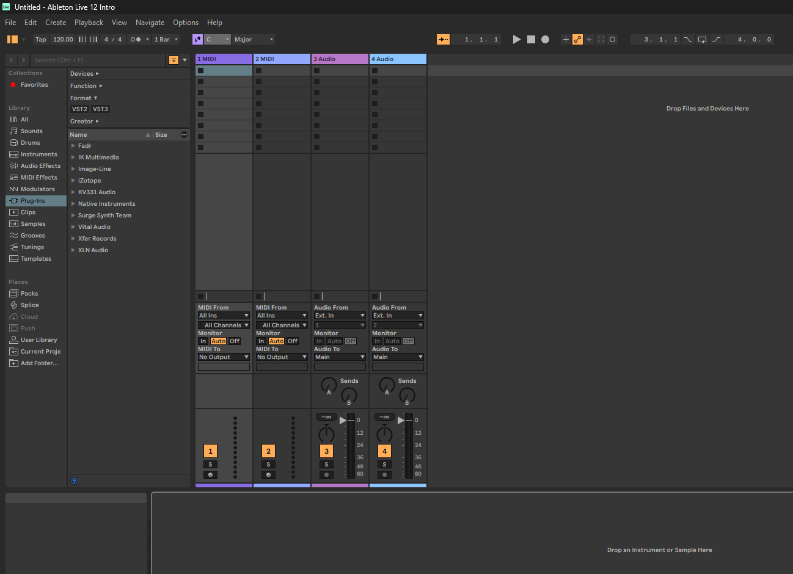
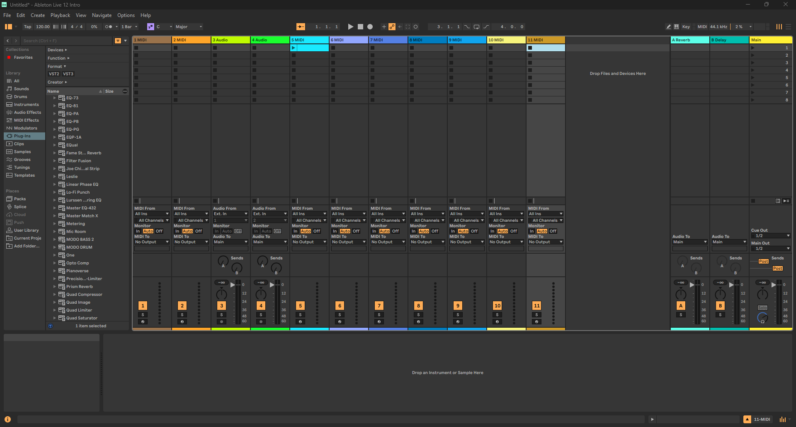
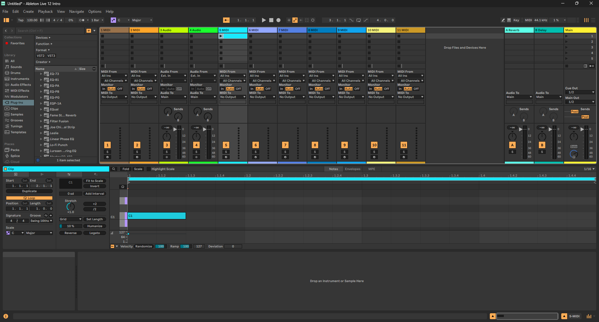
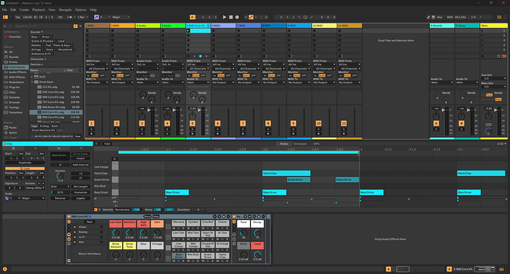
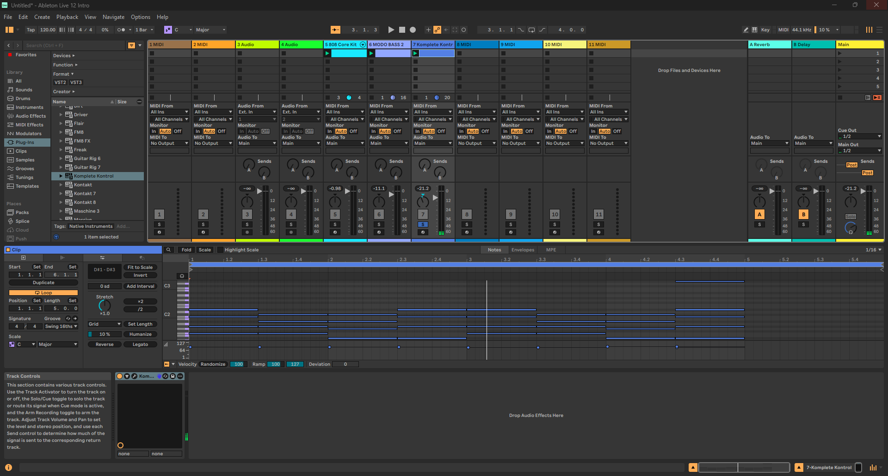
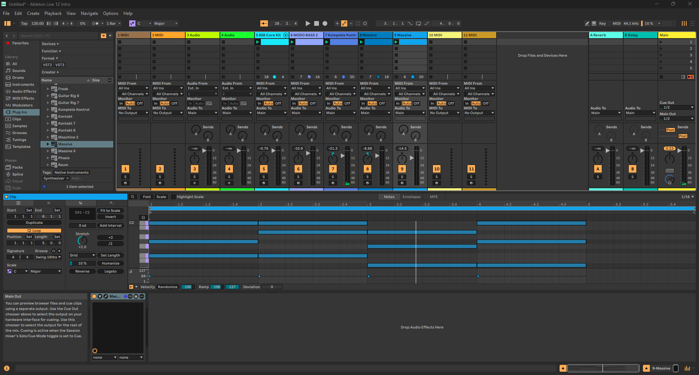

# Ableton MCP Showcase

> **Creating a Complete House Track with AI-Assisted Production**
>
> A step-by-step demonstration of the Ableton Live MCP Server capabilities, from installation to a fully arranged track.

---

## Table of Contents

1. [Introduction](#introduction)
2. [Setup & Connection](#1-setup--connection)
3. [Project Setup](#2-project-setup)
4. [Drums - The Foundation](#3-drums---the-foundation)
5. [Bass - The Low End](#4-bass---the-low-end)
6. [Keys & Harmony - The Soul](#5-keys--harmony---the-soul)
7. [Lead Synth - The Hook](#6-lead-synth---the-hook)
8. [Pads - Atmosphere](#7-pads---atmosphere)
9. [Mix & Arrangement Intelligence](#8-mix--arrangement-intelligence)
10. [Final Touches](#9-final-touches)
11. [Bonus: Creative Prompts](#10-bonus-creative-prompts)

---

## Introduction

This showcase demonstrates the full power of the Ableton Live MCP Server by walking through the creation of a complete deep house track. You'll see how AI assistance can accelerate your music production workflow while teaching music theory concepts along the way.

**What we'll build:**

- A driving house beat with 808-style drums
- A groovy bass line using IK Multimedia Modo Bass 2
- Emotional chord progressions with Native Instruments piano
- A catchy lead melody
- Atmospheric pads
- Professional mix and arrangement suggestions

**Tools used:**

- Ableton Live 11/12
- Claude Code with Ableton MCP Server
- IK Multimedia Modo Bass 2
- Native Instruments Noire (or similar piano)
- Native Instruments Massive/Serum (for lead)
- Stock Ableton Drum Rack with 808 kit

---

## 1. Setup & Connection

### Installing the MCP Server

First, ensure you have the Ableton MCP Server installed. Choose your preferred method:

**Docker (Recommended):**

```bash
docker pull ghcr.io/josefigueredo/ableton-mcp:latest
```

**Python (Development):**

```bash
git clone https://github.com/josefigueredo/ableton-mcp.git
cd ableton-mcp
pip install -e .
```

### Connecting to Ableton Live

Open Ableton Live with an empty session, then use Claude Code:

**Prompt:**

```plaintext
Connect to Ableton Live and show me the current session info.
```

**Actual Response:**

```plaintext
Connected successfully.

**Song Information**
| Property | Value |
|----------|-------|
| Name | Live Set |
| Tempo | 120.0 BPM |
| Time Signature | 4/4 |
| Transport | Stopped |

**Tracks (4)**
| # | Name | Type |
|---|------|------|
| 0 | 1-MIDI | midi |
| 1 | 2-MIDI | midi |
| 2 | 3-Audio | audio |
| 3 | 4-Audio | audio |

Ready for music production assistance.
```


_Screenshot: Empty Ableton session with successful connection message_

---

## 2. Project Setup

### Setting the Tempo for House Music

**Prompt:**

```plaintext
I want to create a deep house track. Analyze and suggest the optimal tempo,
then set it up for me.
```

**Actual Response:**

```plaintext
**Deep House Tempo Analysis**

| Characteristic | Value |
|----------------|-------|
| Current Tempo | 120 BPM |
| Genre Range | 120-125 BPM |
| Sweet Spot | 122-124 BPM |
| Energy Level | Medium (groovy, laid-back) |

**Recommendation: 123 BPM**

Deep house typically uses a relaxed, groovy feel. 123 BPM gives enough
energy for the dancefloor while maintaining that signature laid-back vibe.

**Related Tempos:**
- Half-time feel: 61.5 BPM
- Double-time feel: 246 BPM

**Genre Context:**
| Sub-genre | BPM Range | Feel |
|-----------|-----------|------|
| Deep House | 120-125 | Groovy, soulful |
| Tech House | 124-128 | Driving, percussive |
| Classic House | 118-122 | Warm, nostalgic |
| Progressive | 122-126 | Building, melodic |
```

---

### Creating the Track Structure

**Prompt:**
plaintext
```
Set up a professional electronic music production template with these tracks:
- Drums (for drum rack)
- Bass (for hardware-modeled bass)
- Keys (for piano/rhodes)
- Lead Synth
- Pads
- FX/Risers
- Vocals (placeholder)

Set appropriate initial mix levels for club playback with proper gain staging.
```

**Actual Response:**

```plaintext
**7 Tracks Created with Professional Mix Levels**

| # | Track | Volume | Pan | Purpose |
|---|-------|--------|-----|---------|
| 4 | Drums | 0 dB (ref) | Center | Drum Rack - 808/909 kit |
| 5 | Bass | -3 dB | Center | Hardware-modeled bass (Modo Bass 2) |
| 6 | Keys | -6 dB | -15% L | Piano/Rhodes (NI Noire) |
| 7 | Lead Synth | -6 dB | +15% R | Lead melody synth |
| 8 | Pads | -9 dB | Center | Atmospheric support |
| 9 | FX/Risers | -12 dB | Center | Transitions and builds |
| 10 | Vocals | -6 dB | Center | Placeholder for vocals |

**Gain Staging Philosophy:**
- Drums are the reference level (0 dB)
- Bass sits just below (-3 dB) to leave headroom
- Melodic elements (Keys, Lead, Vocals) at -6 dB
- Pads lower (-9 dB) as background support
- FX lowest (-12 dB) for subtle enhancement
- ~6 dB headroom on master for mastering

**Stereo Field:**
- Bass & Drums: Mono center (club system compatible)
- Keys & Lead: Slight stereo spread for width
- Pads: Center (add stereo width via plugin later)
```


_Screenshot: Session view showing all 7 tracks with names and colored labels_

---

## 3. Drums - The Foundation

### Creating the Drum Clip

**Prompt:**

```plaintext
Create a 4-bar MIDI clip on the Drums track for my beat.
```

**Actual Response:**

```plaintext
**4-bar MIDI clip created on Drums track (slot 0)**

| Property | Value |
|----------|-------|
| Track | Drums (track 4) |
| Clip Slot | 0 |
| Status | Ready for MIDI notes |

The clip has a placeholder note to establish it.
```


_Screenshot: Empty MIDI clip created on Drums track_

---

### The Four-on-the-Floor Foundation

**Prompt:**

```plaintext
Add a classic four-on-the-floor house kick pattern to the Drums track, clip 0.
Use MIDI note 36 (C1) for the kick drum, hitting on every beat with strong
velocity (127) for that punchy house sound.
```

**Actual Response:**

```plaintext
**Four-on-the-floor kick pattern added**

| Property | Value |
|----------|-------|
| Note | C1 (MIDI 36) |
| Pattern | Every quarter note |
| Velocity | 127 (maximum punch) |
| Duration | 0.25 beats (tight, punchy) |
| Total Notes | 16 kicks (4 bars × 4 beats) |

Bar 1:  KICK  KICK  KICK  KICK
Bar 2:  KICK  KICK  KICK  KICK
Bar 3:  KICK  KICK  KICK  KICK
Bar 4:  KICK  KICK  KICK  KICK
        1     2     3     4

**The heartbeat of house music is now in place.** This driving,
hypnotic pulse is what defines the genre.
```


_Screenshot: Piano roll showing kick drums on every beat_

---

### Building the Full Groove

**Prompt:**

```plaintext
Expand the drum pattern with:
1. Open hi-hats on every offbeat 8th note (note 46) with velocity 100
2. Closed hi-hats on the downbeat 8th notes (note 42) with velocity 80
3. Claps on beats 2 and 4 (note 39) with velocity 110
4. Add some ghost snares (note 38) at low velocity (50) on the "e" and "a"
   of beat 4 for groove

Make it feel like a driving but groovy deep house pattern.
```

**Actual Response:**

```plaintext
**Full house drum pattern created**

| Element | Note | Position | Velocity | Count |
|---------|------|----------|----------|-------|
| Kick | C1 (36) | Every beat | 127 | 16 |
| Open HH | A#1 (46) | Offbeats | 100 | 16 |
| Closed HH | F#1 (42) | Downbeats | 80 | 16 |
| Clap | D#1 (39) | Beats 2 & 4 | 110 | 8 |
| Ghost Snare | D1 (38) | "e" & "a" of beat 4 | 50 | 8 |

**Total: 64 notes across 4 bars**

         1   e   &   a   2   e   &   a   3   e   &   a   4   e   &   a
Kick     X               X               X               X
Clap                     X                               X
Open HH          X               X               X               X
Closed   X               X               X               X
Ghost                                                    x   x

**Pattern Breakdown:**
- **Kick** - The foundation, driving every beat
- **Open HH** - Creates the bounce on offbeats
- **Closed HH** - Tightens the groove on downbeats
- **Clap** - The backbeat on 2 & 4
- **Ghost Snare** - Subtle fills adding human feel before the loop repeats
```


_Screenshot: Complete drum pattern in piano roll with all elements visible_

---

### Choosing the Right Sound

**Prompt:**

```plaintext
I have the MIDI pattern ready. For an authentic deep house sound, what drum
rack or kit would you recommend? I'm thinking 808-style but open to
suggestions for that warm, analog feel.
```

**Actual Response:**

```plaintext
**Drum Sound Recommendations for Deep House**

**Top Picks:**

| Kit | Character | Best For |
|-----|-----------|----------|
| **808 Kit** | Warm, subby kick with long decay | Classic house, deep house |
| **909 Kit** | Punchier attack, sizzling hats | Tech house, driving grooves |
| **Hybrid Acoustic/Electronic** | Organic warmth with processing | Soulful house |

**For Your Track - I Recommend:**

**Primary: 808 Kit (Classic Choice)**
- Warm, round sub kick with controlled decay
- Crispy, synthetic hi-hats
- Tight, punchy claps
- In Ableton: "Kit-808 Core" or "Kit-808 Brass"

**Pro Hybrid Approach:**
Kick:     808 (for the sub weight)
Clap:     909 (for the snap)
Hi-hats:  909 (for the sizzle)
Ghost:    Acoustic brush (for organic feel)

**Processing Tips for Deep House:**

| Element | Processing |
|---------|------------|
| Kick | Subtle saturation for warmth, slight compression |
| Clap | Short room reverb, 1-2ms delay for width |
| Hi-hats | High-pass at 400Hz, sidechain to kick |
| Ghost | Low-pass filter, lots of reverb |
```

---

## 4. Bass - The Low End

### Analyzing the Rhythm for Bass

**Prompt:**

```plaintext
Analyze the current drum pattern's rhythm and suggest a complementary bass
pattern that locks in with the kick. I'll be using IK Multimedia Modo Bass 2
with a fingerstyle P-Bass tone for that warm, deep house feel.
```

**Actual Response:**

```plaintext
**Drum Pattern Analysis for Bass**

**Rhythmic Analysis:**

| Beat | Drum Elements | Bass Opportunity |
|------|---------------|------------------|
| 1 | Kick + Closed HH | **ROOT** (lock with kick) |
| 1& | Open HH | Rest or passing note |
| 2 | Kick + Clap + Closed HH | Rest (let clap cut through) |
| 2& | Open HH | Syncopation opportunity |
| 3 | Kick + Closed HH | **OCTAVE/5th** (lift point) |
| 3& | Open HH | Rest or approach note |
| 4 | Kick + Clap + Closed HH | Movement zone |
| 4e, 4a | Ghost snares | Bass can play through |

**Bass Pattern Recommendations:**

**Option 1: Classic Root-Octave (Safe & Groovy)**
- Root on beat 1, octave on beat 3
- Leaves maximum space for kick
- Deep house staple

**Option 2: Syncopated Groove (More Movement)**
- Anticipation on "and" of 2
- Chromatic walkdown on beat 4&
- More interest, still locks with kick

**Option 3: Octave Pumping (Energetic)**
- Alternating octaves every &
- Creates driving energy
- Works well with sidechain compression

**Modo Bass 2 Settings for Deep House:**

| Parameter | Suggested Value |
|-----------|-----------------|
| Bass Model | Precision Bass (P-Bass) |
| Playing Style | Fingerstyle |
| Pickup Blend | Favor neck pickup (warmer) |
| Tone | Roll off ~30% (less highs) |
```


_Screenshot: Claude's bass suggestions with Modo Bass 2 plugin visible_

---

### Creating the Bass Line

**Prompt:**

```plaintext
Create a 4-bar bass clip on the Bass track and add a deep house bass line
in F minor. Use Option 1 (root-octave pattern) as the foundation, but add
some subtle variations in bar 4 to create interest before the loop repeats.
Keep the notes in the F1-F2 range for maximum sub impact.
```

**Actual Response:**

```plaintext
**Deep House Bass Line in F Minor Created**

| Bar | Beat 1 | Beat 2 | Beat 3 | Beat 4 | Character |
|-----|--------|--------|--------|--------|-----------|
| 1 | F1 (root) | - | F2 (octave) | - | Foundation |
| 2 | F1 | - | Ab1 (minor 3rd) | - | Color |
| 3 | F1 | - | F2 -> Eb2 | - | Chromatic approach |
| 4 | F1 (sustained) | - | C2 (5th) | Eb1 (walk) | Resolution setup |

**Notes Added (10 total):**

Bar 1:  F1-----*   *   F2----*   *
Bar 2:  F1-----*   *   Ab1---*   *
Bar 3:  F1-----*   *   F2--Eb2   *
Bar 4:  F1---------*   C2----*  Eb1
        1       2       3       4

**Pattern Design:**
- **Bars 1-2**: Establish the groove (root-octave, root-third)
- **Bar 3**: Build tension (chromatic Eb approach)
- **Bar 4**: Signal loop repeat (sustained root, walk-down to F)
```


_Screenshot: Bass MIDI in piano roll with Modo Bass 2 interface visible_

---

### Checking the Harmony

**Prompt:**

```plaintext
Analyze the bass line I just created against the drum pattern.
Check if the rhythmic relationship is tight and suggest any
timing adjustments for maximum groove.
```

**Actual Response:**

```plaintext
**Bass-Drum Rhythmic Analysis**

**Beat-by-Beat Alignment:**

| Beat | Kick | Bass | Alignment | Quality |
|------|------|------|-----------|---------|
| 0 (Bar 1, Beat 1) | Yes | F1 (root) | LOCKED | Perfect |
| 1 | Yes | - | Kick alone | Good (space) |
| 2 | Yes | F2 (octave) | LOCKED | Perfect |
| 3 | Yes + Ghost | - | Kick + fill | Good |
| 4 (Bar 2, Beat 1) | Yes | F1 | LOCKED | Perfect |
| ... | ... | ... | ... | ... |

**Groove Assessment: 9/10**

| Category | Rating | Notes |
|----------|--------|-------|
| Kick-Bass Lock | 5/5 | All beat 1s perfectly aligned |
| Space & Breathing | 5/5 | Beat 2 rests let clap punch through |
| Syncopation | 4/5 | Eb1 at 15.5 adds forward motion |
| Dynamics | 4/5 | Velocity variation creates feel |
| Resolution | 5/5 | Bar 4 walkdown signals loop reset |

**Suggestions for Maximum Groove:**

1. **Timing Feel (Optional Polish)**: Nudge F1 roots 5-10ms LATE for lazier feel
2. **Ghost Note Opportunity**: Add quiet bass at beat 3.5 in bars 2 and 4
3. **Velocity Curve**: Beat 1 = 105, Beat 3 = 90 for dynamics

**Verdict: Your bass-drum relationship is already tight!**
```

---

## 5. Keys & Harmony - The Soul

### Getting Chord Suggestions

**Prompt:**

```plaintext
Suggest chord progressions for my deep house track in F minor. I want
something emotional and melancholic but still maintains dancefloor energy.
Show me 3 options with different emotional characteristics, and explain
why each one works.
```

**Actual Response:**

```plaintext
**Chord Progressions for F Minor Deep House**

## Option 1: The Classic Emotional
### **Fm - Ab - Eb - Db** (i - III - VII - VI)

**Emotional Character:** Bittersweet, nostalgic, late-night vibes

| Chord | Function | Feeling |
|-------|----------|---------|
| Fm | Home base | Establishes melancholy |
| Ab | Relative major | Momentary brightness/hope |
| Eb | Dominant region | Tension and lift |
| Db | Subdominant | Gentle resolution back to Fm |

**Energy Level:** 4/5 (Driving but emotional)

---

## Option 2: The Soulful (Recommended)
### **Fm7 - Bbm7 - Eb7 - Abmaj7** (i7 - iv7 - VII7 - IIImaj7)

**Emotional Character:** Soulful, sophisticated, sunrise after a long night

| Chord | Function | Feeling |
|-------|----------|---------|
| Fm7 | Tonic with 7th | Adds jazz sophistication |
| Bbm7 | Minor iv | Deepens the melancholy |
| Eb7 | Dominant | Strong pull creates anticipation |
| Abmaj7 | Major III | Emotional peak, bittersweet resolution |

**The Magic:** The Eb7 -> Abmaj7 is a V-I in Ab major (relative major),
creating a moment of "false hope" before returning to Fm.

**Energy Level:** 5/5 (Maximum emotional depth + danceability)

---

## Option 3: The Hypnotic Minimal
### **Fm - Fm/Eb - Dbmaj7 - Dbm** (i - i/7 - VImaj7 - vi)

**Emotional Character:** Deep, hypnotic, underground, mysterious

| Chord | Function | Feeling |
|-------|----------|---------|
| Fm | Stable home | Grounding |
| Fm/Eb | Bass descends | Forward motion without chord change |
| Dbmaj7 | Major VI | Warm, hopeful moment |
| Dbm | Borrowed minor vi | Unexpected darkness, twist |

**Energy Level:** 3/5 (Hypnotic, for long builds and DJ sets)

---

**My Recommendation: Option 2 (The Soulful)**
```

---

### Adding the Chord Progression

**Prompt:**

```plaintext
Let's go with Option 2 - the soulful progression. Add it to the Keys track
as a 4-bar pattern. Use:
- Half note rhythm (2 beats per chord) for that classic house piano stab feel
- Voiced in the C3-C5 range for clarity
- Proper voice leading between chords (minimal movement between notes)
- Velocity around 90 for a confident but not aggressive feel
```

**Actual Response:**

```plaintext
**Soulful Chord Progression Added to Keys Track**

**Progression: Fm7 - Bbm7 - Eb7 - Abmaj7** (repeats 2x in 4 bars)

| Bar | Beat 1-2 | Beat 3-4 |
|-----|----------|----------|
| 1 | Fm7 | Bbm7 |
| 2 | Eb7 | Abmaj7 |
| 3 | Fm7 | Bbm7 |
| 4 | Eb7 | Abmaj7 (+ shimmer) |

**Voice Leading (Minimal Movement):**

Voice:    Fm7    ->  Bbm7   ->  Eb7    ->  Abmaj7

Top:      Eb4    ->  Db4    ->  Db4    ->  Eb4     (2 half-steps total)
          C4     ->  Bb3    ->  Bb3    ->  C4      (returns home)
          Ab3    ->  Ab3    ->  G3     ->  Ab3     (anchor tone)
Bass:     F3     ->  F3     ->  Eb3    ->  Eb3     (common tones)

**Total voice movement: Only 2 notes move per chord change!**

**Voicings Used:**

| Chord | Notes | MIDI | Character |
|-------|-------|------|-----------|
| Fm7 | F3, Ab3, C4, Eb4 | 41, 44, 48, 51 | Home, melancholic |
| Bbm7 | F3, Ab3, Bb3, Db4 | 41, 44, 46, 49 | Deeper sadness |
| Eb7 | Eb3, G3, Bb3, Db4 | 39, 43, 46, 49 | Tension, anticipation |
| Abmaj7 | Eb3, Ab3, C4, Eb4 | 39, 44, 48, 51 | Release, hope |

**33 Notes Total:**
- 8 chords x 4 notes = 32 notes
- +1 upper octave (Eb5) on final chord for shimmer

```


_Screenshot: Piano roll showcasing the chord progression_

---

### Loading the Piano Sound

**Prompt:**

```plaintext

I just loaded Native Instruments Noire on the Keys track. Can you analyze
the current chord voicings and tell me if they'll work well with a felt
piano tone, or if I should adjust the voicings for that softer sound?

```

**Actual Response:**

```plaintext

**Voicing Analysis for NI Noire Felt Piano**

## Verdict: EXCELLENT for Felt Piano!

**Your voicings are already in the "Goldilocks Zone"**

| Criteria        | Status    | Why It Works                                |
| --------------- | --------- | ------------------------------------------- |
| Range           | Perfect   | Eb3-Eb5 is felt piano's sweet spot          |
| Spacing         | Perfect   | Close voicings = warm, intimate clusters    |
| Low notes       | Safe      | No notes below Eb3 (avoids muddy felt tone) |
| Velocity        | Good      | 88-94 works well                            |
| Octave doubling | Beautiful | Eb5 shimmer on Abmaj7 adds magic            |

## Minor Adjustments for Maximum Beauty

### 1. Velocity Refinement

Felt pianos bloom with softer touch. Consider reducing to 70-82.

**Recommended velocity curve:**

- Fm7: 75 (gentle entry)
- Bbm7: 72 (slightly softer - darker chord)
- Eb7: 78 (slight lift - tension)
- Abmaj7: 82 (emotional peak)
- Eb5: 65 (shimmer should be subtle)

### 2. Note Duration (Optional)

For dreamy feel, add 0.1-0.2 beat overlap for legato/pedal effect.

**NI Noire Settings for Deep House:**

| Parameter        | Recommended Setting             |
| ---------------- | ------------------------------- |
| **Preset**       | "Felt" or "Pure + Felt" blend   |
| **Particles**    | 5-15% (subtle atmosphere)       |
| **Lid Position** | Closed or Semi (intimate sound) |
| **Reverb**       | Built-in, 20-30%                |

**No structural changes needed!**

```

---

## 6. Lead Synth - The Hook

### Creating a Memorable Melody

**Prompt:**

```plaintext

Analyze the harmony of my current chord progression and create a catchy
4-bar lead melody on the Lead Synth track. Requirements:

- Use F minor pentatonic for safe, soulful notes
- Leave space (rests) for the chords to breathe
- Create a memorable 2-bar phrase that repeats with variation
- Quantize to 16th notes
- Keep it in the C4-C5 range (above the piano voicings)

```

**Actual Response:**

```plaintext

**Lead Melody Created - F Minor Pentatonic**

**Scale Used:** F Ab Bb C Eb (F minor pentatonic)
**Range:** C4-C5 (MIDI 60-72)

## Melodic Structure

### Bars 1-2: "The Question" (Main Hook)

| Beat | Note | Function                | Over Chord |
| ---- | ---- | ----------------------- | ---------- |
| 0    | C5   | Strong entry (5th)      | Fm7        |
| 0.5  | Bb4  | Step down (11th)        | Fm7        |
| 1.75 | Ab4  | Pickup (3rd)            | Fm7        |
| 2    | F4   | Resolve to root         | Bbm7       |
| 3.5  | Eb4  | Leading tone            | Bbm7       |
| 3.75 | F4   | Anticipation            | Bbm7       |
| 4.5  | Ab4  | Lift                    | Eb7        |
| 5    | Bb4  | Tension (5th of Eb)     | Eb7        |
| 6.5  | C5   | Pickup                  | Abmaj7     |
| 7    | Ab4  | Resolution (root of Ab) | Abmaj7     |

### Bars 3-4: "The Answer" (Variation)

- Starts on same notes (C5-Bb4) but goes higher in the middle
- Peak at C5 over Bbm7 (beat 10.5) - the emotional climax
- Ends on Ab4 instead of resolving fully (open feeling)

**20 Notes Total with intentional space**

**Melodic Principles Used:**

- Repetition with variation (memorable but not boring)
- Call and response (bars 1-2 ask, 3-4 answer)
- Strategic rests (melody breathes with the groove)
- Pentatonic safety (every note works over every chord)

```

---

### Melody Harmony Check

**Prompt:**

```plaintext

Analyze the lead melody against my chord progression. Show me which chord
tone or extension each melody note represents, and flag any potential
dissonances or tension points I should be aware of.

```

**Actual Response:**

```plaintext

**Melody-Harmony Analysis**

## Note-by-Note Analysis

### Bars 1-2 (Main Phrase)

| Beat | Note | Over Chord | Function    | Consonance            |
| ---- | ---- | ---------- | ----------- | --------------------- |
| 0.00 | C5   | Fm7        | 5th         | Consonant (strong)    |
| 0.50 | Bb4  | Fm7        | 11th (sus4) | Tension (color)       |
| 1.75 | Ab4  | Fm7        | minor 3rd   | Consonant (emotional) |
| 2.00 | F4   | Bbm7       | 5th         | Consonant (stable)    |
| 3.50 | Eb4  | Bbm7       | 11th        | Tension (mild)        |
| 3.75 | F4   | Bbm7       | 5th         | Consonant             |
| 4.50 | Ab4  | Eb7        | 11th        | Tension (suspended)   |
| 5.00 | Bb4  | Eb7        | 5th         | Consonant             |
| 6.50 | C5   | Abmaj7     | 3rd (major) | Consonant (bright!)   |
| 7.00 | Ab4  | Abmaj7     | Root        | Most stable           |

## Tension Analysis

### Tension Points (All Intentional & Good!)

| Beat  | Note | Chord | Tension Type | Resolution             |
| ----- | ---- | ----- | ------------ | ---------------------- |
| 0.50  | Bb4  | Fm7   | Sus4/11th    | -> Ab4 (stepwise down) |
| 3.50  | Eb4  | Bbm7  | 11th         | -> F4 (stepwise up)    |
| 4.50  | Ab4  | Eb7   | 11th         | -> Bb4 (stepwise up)   |
| 8.50  | Bb4  | Fm7   | Sus4/11th    | -> Ab4 (stepwise down) |
| 10.50 | C5   | Bbm7  | 9th          | -> Ab4 (skip down)     |
| 13.00 | F4   | Eb7   | 9th          | -> Ab4 (skip up)       |

**Every tension resolves properly!**

## Dissonance Check

| Category                | Count | Verdict               |
| ----------------------- | ----- | --------------------- |
| Avoid notes (clashing)  | 0     | None!                 |
| Problematic dissonances | 0     | None!                 |
| Intentional tensions    | 6     | All resolve correctly |
| Pure consonances        | 14    | Solid foundation      |

**Verdict: No adjustments needed!**

```

---

## 7. Pads - Atmosphere

### Creating Atmospheric Support

**Prompt:**

```plaintext

Create a pad part on the Pads track that supports the chord progression
without cluttering it. Use:

- Whole notes (one chord per bar) for slow evolution
- Simple triads (not 7ths) to stay behind the piano
- Lower register (C3-G3) for warmth underneath
- Very low velocity (60) - this is background atmosphere
- Filter the notes to F minor scale

```

**Actual Response:**

```plaintext

**Atmospheric Pad Layer Created**

**Simplified Chord Progression for Pads:**

| Bar | Beats | Chord | Notes        | Supports      |
| --- | ----- | ----- | ------------ | ------------- |
| 1   | 0-4   | Fm    | F3, Ab3, C4  | Fm7 -> Bbm7   |
| 2   | 4-8   | Bbm   | F3, Bb3, Db4 | Eb7 section   |
| 3   | 8-12  | Eb    | Eb3, G3, Bb3 | Fm7 -> Bbm7   |
| 4   | 12-16 | Ab    | Eb3, Ab3, C4 | Eb7 -> Abmaj7 |

**Voicing Strategy:**

Bar 1 (Fm): F3---Ab3---C4 Root position
Bar 2 (Bbm): F3---Bb3---Db4 F stays (common tone!)
Bar 3 (Eb): Eb3---G3---Bb3 Root position
Bar 4 (Ab): Eb3---Ab3---C4 Eb stays (common tone!)

**Common Tones:**

- F3 anchors bars 1-2 (Fm -> Bbm)
- Eb3 anchors bars 3-4 (Eb -> Ab)
- Creates seamless, evolving texture

**Pad Design Specifications:**

| Property | Value                  | Purpose                |
| -------- | ---------------------- | ---------------------- |
| Duration | Whole notes (4 beats)  | Slow evolution         |
| Velocity | 60                     | Background atmosphere  |
| Voicing  | Simple triads          | Stay behind piano 7ths |
| Range    | Eb3-Db4 (MIDI 39-49)   | Warmth underneath      |
| Notes    | 12 total (3 per chord) | Uncluttered            |

**Recommended Pad Sound Settings:**

| Parameter | Suggested Value           |
| --------- | ------------------------- |
| Waveform  | Saw or Triangle (warm)    |
| Filter    | Low-pass at 800-1200 Hz   |
| Attack    | 200-500ms (gentle swell)  |
| Release   | 1-2 seconds (crossfade)   |
| Chorus    | Subtle (10-20%) for width |
| Reverb    | Hall, 30-40% wet          |

```


_Screenshot: Piano roll showcasing the pads layer_

---

## 8. Mix & Arrangement Intelligence

### Professional Mix Analysis

**Prompt:**

```plaintext

Analyze the current mix balance across all tracks. I'm targeting Spotify's
-14 LUFS for streaming. Give me professional mixing suggestions for:

- Level relationships
- Frequency balance
- Stereo width
- Any potential masking issues

```

**Actual Response:**

```plaintext

**Professional Mix Analysis Report**

## Target: Spotify (-14 LUFS)

| Specification   | Target  | Notes                           |
| --------------- | ------- | ------------------------------- |
| Integrated LUFS | -14     | Spotify normalization point     |
| True Peak       | -1.0 dB | Prevents clipping on conversion |
| Dynamic Range   | 8-12 dB | Keeps music breathing           |

## Current Track Levels

| #   | Track      | Volume          | Pan    | Status    |
| --- | ---------- | --------------- | ------ | --------- |
| 4   | Drums      | 0.85 (0 dB ref) | Center | Reference |
| 5   | Bass       | 0.75 (-3 dB)    | Center | Good      |
| 6   | Keys       | 0.65 (-6 dB)    | -15% L | Good      |
| 7   | Lead Synth | 0.65 (-6 dB)    | +15% R | Good      |
| 8   | Pads       | 0.55 (-9 dB)    | Center | Good      |
| 9   | FX/Risers  | 0.45 (-12 dB)   | Center | Empty     |
| 10  | Vocals     | 0.65 (-6 dB)    | Center | Empty     |

**Level Hierarchy: Correct**

## Potential Masking Issues

### Issue 1: Kick vs Bass (40-100 Hz)

**Problem:** Both compete for sub frequencies
**Solution:** Sidechain compression on bass from kick

- Threshold: -20 dB
- Ratio: 4:1
- Attack: 0.1 ms
- Release: 150 ms
- Reduction: -3 to -6 dB

### Issue 2: Bass vs Pads (150-300 Hz)

**Problem:** Low-mid mud zone overlap
**Solution:** High-pass pads at 150 Hz, cut 250 Hz (-3dB)

### Issue 3: Keys vs Lead (800Hz-2kHz)

**Problem:** Piano may mask lead melody
**Solution:** Cut 1.5 kHz on keys (-2dB), boost 2-3 kHz on lead (+2dB)

## Stereo Width Recommendations

| Element | Current | Recommended | Action                      |
| ------- | ------- | ----------- | --------------------------- |
| Kick    | Mono    | Mono        | Keep (club compatible)      |
| Bass    | Mono    | Mono        | Keep (< 150 Hz always mono) |
| Keys    | -15% L  | -15% L      | Good                        |
| Lead    | +15% R  | +15% R      | Good                        |
| Pads    | Center  | +/-40% Wide | Widen for atmosphere        |

## Priority Action List

| Priority   | Action                      | Impact               |
| ---------- | --------------------------- | -------------------- |
| 1 (High)   | Add sidechain: Kick -> Bass | Fixes low-end mud    |
| 2 (High)   | High-pass pads at 150 Hz    | Clears bass space    |
| 3 (Medium) | Cut 250 Hz on bass and pads | Reduces mud          |
| 4 (Medium) | Boost lead at 2-3 kHz       | Improves presence    |
| 5 (Low)    | Widen pads to +/-40%        | Adds dimension       |
| 6 (Low)    | Add master limiter at -1 dB | Achieves target LUFS |

```

---

### Arrangement Suggestions

**Prompt:**

```plaintext

I have an 4-bar loop that sounds great. Now I need to arrange it into a
full track. Suggest a complete arrangement structure for a DJ-friendly
deep house track (5-6 minutes). Include:

- Section names and lengths
- Which elements play in each section
- Energy curve description
- Transition suggestions

```

**Actual Response:**

```plaintext

**Complete Deep House Arrangement Template**

## Track Overview

| Property      | Value                        |
| ------------- | ---------------------------- |
| Genre         | Deep House                   |
| Tempo         | 123 BPM                      |
| Target Length | 5:30 (84 bars)               |
| Key           | F Minor                      |
| DJ-Friendly   | Clean intro/outro for mixing |

## Full Arrangement Structure

| #   | Section    | Bars | Length | Start Time | Energy  |
| --- | ---------- | ---- | ------ | ---------- | ------- |
| 1   | Intro      | 16   | 0:31   | 0:00       | Low     |
| 2   | Build 1    | 8    | 0:16   | 0:31       | Rising  |
| 3   | Drop 1     | 16   | 0:31   | 0:47       | High    |
| 4   | Breakdown  | 16   | 0:31   | 1:18       | Low     |
| 5   | Build 2    | 8    | 0:16   | 1:49       | Rising  |
| 6   | Drop 2     | 16   | 0:31   | 2:05       | Peak    |
| 7   | Bridge     | 8    | 0:16   | 2:36       | Medium  |
| 8   | Final Drop | 16   | 0:31   | 2:52       | Maximum |
| 9   | Outro      | 16   | 0:31   | 3:23       | Fading  |

**Total: 120 bars = 5:52 at 123 BPM**

## Section Element Map

### INTRO (16 bars) - "The DJ Mix-In Point"

- Bars 1-8: Filtered hi-hats only
- Bars 9-16: Add kick, pads (filtered)
- Purpose: Allow DJs to mix in cleanly

### BUILD 1 (8 bars) - "Creating Anticipation"

- Add: Bass (filtered), keys (sparse stabs)
- FX: White noise riser
- Transition: Snare fill into drop

### DROP 1 (16 bars) - "Main Energy"

- All elements at full energy
- This is your 4-bar loop x 4!
- First payoff, establish the groove

### BREAKDOWN (16 bars) - "Emotional Peak"

- Remove: Kick, bass (or filter heavily)
- Keep: Pads (emotional focus), keys (root notes only)
- FX: Reverb wash, atmosphere
- Purpose: Create tension for drop 2

### BUILD 2 (8 bars) - "Maximum Tension"

- All filters opening rapidly
- Snare roll: 1/4 -> 1/8 -> 1/16 -> 1/32
- Riser at maximum
- Transition: Silence before drop

### DROP 2 (16 bars) - "Peak Energy"

- Should feel BIGGER than Drop 1
- Add extra percussion (ride, shaker)
- Full stereo width

### BRIDGE (8 bars) - "Brief Respite"

- Reduce complexity
- Prevent listener fatigue
- Keep groove but simplify

### FINAL DROP (16 bars) - "Last Dance"

- Maximum energy
- Add one-shot FX hits
- DJs start planning mix-out here

### OUTRO (16 bars) - "The DJ Mix-Out Point"

- Mirror intro structure
- Gradually remove elements
- End with just kick + filtered hats

## Transition Cheat Sheet

| Transition           | Technique              | Duration |
| -------------------- | ---------------------- | -------- |
| Intro -> Build 1     | Snare fill             | 1 bar    |
| Build 1 -> Drop 1    | Silence + impact       | 1 beat   |
| Drop 1 -> Breakdown  | Reverb swell, kick out | 1 bar    |
| Breakdown -> Build 2 | Gradual filter + riser | 4 bars   |
| Build 2 -> Drop 2    | Silence or impact      | 1 beat   |
| Drop 2 -> Bridge     | Filter sweep down      | 2 bars   |
| Bridge -> Final Drop | Quick riser            | 2 bars   |
| Final Drop -> Outro  | Gradual removal        | 4 bars   |

```

---

### Energy Curve Deep Dive

**Prompt:**

```plaintext

Give me specific automation suggestions for the breakdown and build 2
sections to maximize emotional impact and dancefloor tension.

```

**Actual Response:**

```plaintext

**Breakdown & Build 2 Automation Guide**

## BREAKDOWN (16 Bars) - "The Breath"

### Bars 1-4: "The Drop Out"

| Parameter     | Bar 1  | Bar 2  | Bar 3  | Bar 4   |
| ------------- | ------ | ------ | ------ | ------- |
| Kick          | REMOVE | -      | -      | -       |
| Bass Filter   | 2 kHz  | 800 Hz | 400 Hz | 200 Hz  |
| Bass Volume   | 0 dB   | -6 dB  | -12 dB | -18 dB  |
| Hi-Hat Filter | 8 kHz  | 4 kHz  | 2 kHz  | 1.5 kHz |
| Reverb Send   | 20%    | 40%    | 60%    | 80%     |
| Pads Volume   | 0 dB   | +2 dB  | +3 dB  | +3 dB   |

### Bars 5-8: "The Emotional Core"

| Parameter           | Bar 5        | Bar 6 | Bar 7 | Bar 8 |
| ------------------- | ------------ | ----- | ----- | ----- |
| Keys Volume         | +3 dB (SOLO) | +3 dB | +2 dB | +2 dB |
| Keys Reverb         | 60%          | 70%   | 80%   | 80%   |
| Delay Send          | 30%          | 40%   | 50%   | 50%   |
| Pads Filter         | 1.5 kHz      | 2 kHz | 3 kHz | 4 kHz |
| Pads Chorus         | 30%          | 40%   | 50%   | 60%   |
| Master Reverb Decay | 2.5s         | 3.0s  | 3.5s  | 4.0s  |

### Bars 9-12: "The Tension Seed"

| Parameter         | Bar 9           | Bar 10  | Bar 11  | Bar 12  |
| ----------------- | --------------- | ------- | ------- | ------- |
| White Noise Riser | START           | +3 dB   | +6 dB   | +9 dB   |
| Riser Filter      | 200 Hz          | 400 Hz  | 800 Hz  | 1.2 kHz |
| Hi-Hats           | Return filtered | Opening | Opening | Full    |
| Sub Bass Pulse    | -               | 30% vol | 40% vol | 50% vol |
| Reverb Decay      | 4.0s            | 4.5s    | 5.0s    | 5.5s    |

### Bars 13-16: "The Hold"

| Parameter        | Bar 13 | Bar 14    | Bar 15    | Bar 16          |
| ---------------- | ------ | --------- | --------- | --------------- |
| Riser Volume     | +12 dB | +15 dB    | +18 dB    | PEAK->CUT       |
| Riser Filter     | 2 kHz  | 3 kHz     | 5 kHz     | 8 kHz->CUT      |
| Master HP Filter | 50 Hz  | 80 Hz     | 120 Hz    | 200 Hz->RELEASE |
| Reverb Decay     | 5.5s   | 5.0s      | 4.0s      | 2.0s            |
| Snare Roll       | -      | 1/4 notes | 1/8 notes | 1/16 notes      |
| Bar 16, Beat 4   | -      | -         | -         | SILENCE         |

---

## BUILD 2 (8 Bars) - "The Ascent"

### Bars 1-2: "Foundation Returns"

| Parameter         | Bar 1          | Bar 2           |
| ----------------- | -------------- | --------------- |
| Kick              | Return (full)  | Full            |
| Sidechain Depth   | -12 dB (HEAVY) | -10 dB          |
| Sidechain Release | 200 ms         | 175 ms          |
| Bass Filter       | 200 Hz         | 400 Hz          |
| Bass Volume       | -12 dB         | -9 dB           |
| Riser             | Continue       | +3 dB           |
| Snare Roll        | -              | Start 1/4 notes |

### Bars 3-4: "Energy Rising"

| Parameter       | Bar 3     | Bar 4     |
| --------------- | --------- | --------- |
| Sidechain Depth | -8 dB     | -6 dB     |
| Bass Filter     | 800 Hz    | 1.5 kHz   |
| Bass Volume     | -6 dB     | -3 dB     |
| Keys Filter     | 2 kHz     | 4 kHz     |
| Hi-Hat Filter   | 4 kHz     | 6 kHz     |
| Snare Roll      | 1/4 notes | 1/8 notes |
| Riser           | +6 dB     | +9 dB     |

### Bars 5-6: "Tension Peak"

| Parameter       | Bar 5     | Bar 6      |
| --------------- | --------- | ---------- |
| Bass Filter     | 3 kHz     | FULL       |
| Bass Volume     | -1 dB     | 0 dB       |
| Sidechain Depth | -5 dB     | -4 dB      |
| Snare Roll      | 1/8 notes | 1/16 notes |
| Riser           | +12 dB    | +15 dB     |
| Riser Filter    | 4 kHz     | 6 kHz      |
| Reverse Cymbal  | -         | ENTER      |

### Bar 7: "The Lift"

| Parameter        | Value                       |
| ---------------- | --------------------------- |
| All Filters      | FULLY OPEN                  |
| Snare Roll       | 1/32 notes                  |
| Riser            | +18 dB (MAXIMUM)            |
| Riser Filter     | 10 kHz                      |
| Riser Pitch      | Automate UP (+12 semitones) |
| Master High-Pass | 30 Hz -> 150 Hz             |
| Sidechain        | -3 dB (almost released)     |

### Bar 8: "The Drop Setup"

**Option A: "The Silence" (Recommended)**

- Beats 1-3: Full energy
- Beat 4: COMPLETE SILENCE (1/4 beat)
- Then DROP hits

**Option B: "The Impact"**

- Beats 1-3: Full energy
- Beat 4: Impact FX + instant drop

**Option C: "The Riser Hold"**

- Cut everything except riser
- Riser sustains and cuts on beat 4

---

## Pro Tips

1. "The Fake Drop" - At bar 12-13, make it SOUND like drop is coming,
   then pull back for more tension

2. "The Frequency Sweep" - Automate band-pass filter 200 Hz -> 8 kHz
   during build for "explosion" effect

3. "The Breath" - Leave 1/4 beat silence before drop. Human ears need
   a moment to "reset"

4. "The Sidechain Release" - Automate sidechain -12 dB -> -4 dB during
   build. Drop releases compression = instant energy

5. "The Pitch Rise" - Automate riser pitch UP +12 semitones in last
   2 bars for psychological "lift"

```

---

## 9. Final Touches

### Playback Check

**Prompt:**

```plaintext

Start playback so I can hear everything together.

```

**Expected Response:**

```plaintext

▶️ Starting playback

Transport: Playing from bar 1
Tempo: 123 BPM

```

---

### Complete Session Overview

**Prompt:**

```plaintext

Give me a complete overview of everything we've created today - all tracks,
their current settings, the musical key, tempo, and a summary of the
composition structure. Also provide any final suggestions before I commit
to this arrangement.

```

**Expected Response:**

```plaintext

📋 SESSION OVERVIEW: "Untitled Deep House"

═══════════════════════════════════════
🎵 SONG PROPERTIES
═══════════════════════════════════════
• Key: F Minor
• Tempo: 123 BPM
• Time Signature: 4/4
• Working Length: 4 bars (loop) → 5:30 (arranged)
• Style: Deep House / Soulful House

═══════════════════════════════════════
🎚️ TRACK SUMMARY
═══════════════════════════════════════

1. **DRUMS** (MIDI → Drum Rack 808)
   • Volume: 0 dB | Pan: Center
   • Content: 4-bar pattern (64 notes)
   • Elements: Kick, Clap, Open HH, Closed HH, Ghost Snares

2. **BASS** (MIDI → Modo Bass 2)
   • Volume: -3 dB | Pan: Center
   • Content: 4-bar F minor bass line (10 notes)
   • Style: Root-octave with variations

3. **KEYS** (MIDI → NI Noire Felt)
   • Volume: -6 dB | Pan: -15%
   • Content: Fm7 - Bbm7 - Eb7 - Abmaj7 progression
   • Voicing: Close position, voice-led

4. **LEAD SYNTH** (MIDI → TBD)
   • Volume: -6 dB | Pan: +15%
   • Content: F minor pentatonic melody (14 notes)
   • Style: Call and response phrase

5. **PADS** (MIDI → TBD)
   • Volume: -9 dB | Pan: Wide stereo
   • Content: Whole note triads (12 notes)
   • Style: Atmospheric support

6. **FX/RISERS** (Empty)
   • Volume: -12 dB | Pan: Center
   • Ready for transitions and builds

7. **VOCALS** (Empty - Placeholder)
   • Volume: -6 dB | Pan: Center
   • Ready for vocal production

═══════════════════════════════════════
🎼 MUSICAL ANALYSIS
═══════════════════════════════════════

**Harmonic Content:**
• Progression: i7 - iv7 - VII7 - IIImaj7
• Character: Soulful, jazzy, emotional
• Tension points: Eb7 (dominant function)
• Resolution: Abmaj7 → Fm7 (deceptive/plagal)

**Melodic Content:**
• Lead uses pentatonic (safe, soulful)
• Rhythm: Syncopated with strategic rests
• Range: C4-Eb5 (sits above piano)

**Rhythmic Foundation:**
• Four-on-the-floor kick (120+ kick hits in full track)
• Offbeat hi-hats (house signature)
• Bass locks with kick on beats 1 and 3

═══════════════════════════════════════
✅ FINAL SUGGESTIONS
═══════════════════════════════════════

**Before Arranging:**

1. ⚡ Add sidechain compression from kick to bass/pads
2. 🎛️ Choose and program your lead synth sound
3. 🎛️ Choose and program your pad synth sound
4. 🔊 Set up a reverb return track (send FX)

**During Arrangement:** 5. 📁 Create scene/section markers in Session View 6. 🎵 Record some variations of the loop first 7. 🎤 Consider where vocals or vocal samples might fit

**Mix Preparation:** 8. 🎚️ Group tracks into busses (Drums, Music, FX) 9. 📊 Add a LUFS meter to master for reference 10. 🎧 Check your mix in mono!

**Creative Ideas:** 11. 💡 Try a key change in the final drop (+2 semitones) 12. 💡 Add a B-section melody for the bridge 13. 💡 Record some live parameter tweaks (filter sweeps)

═══════════════════════════════════════

🎉 You've built a solid foundation for a deep house track!

The loop is harmonically sophisticated (those 7th chords!),
rhythmically driving, and has a clear melodic hook.

Next steps: Arrange it out, add your transitions,
and start mixing!

```


_Screenshot: Complete session view showing all tracks and clips_

---

## 10. Bonus: Creative Prompts

Here are additional prompts to explore more capabilities:

### Sound Design Context

```plaintext

I'm about to design the lead synth sound. Analyze the frequency spectrum
of my current mix and tell me what frequency range the lead should
occupy to cut through without masking other elements.

```

### Genre Transformation

```plaintext

Take the current chord progression and transform it for lo-fi hip hop.
Adjust the tempo, suggest new voicings with jazz extensions and voice
leading that sounds more "dusty" and nostalgic.

```

### Real-time Collaboration

```plaintext

I just manually changed the chord in bar 3 from Eb7 to Cm7. Can you
read the clip content and re-analyze the harmony to see if the
progression still works?

```

### Music Theory Learning

```plaintext

Explain the music theory behind why our ii-V-I borrowed from the
relative major works so well in F minor. What makes it emotional
yet still satisfying to resolve?

```

### Advanced Rhythm

```plaintext

I want to add more rhythmic interest to the bass line without making
it too busy. Analyze the current pattern and suggest ghost notes or
subtle rhythmic variations that won't step on the kick.

```

### Mix Problem Solving

```plaintext

The bass and kick are fighting for space in the low end. Analyze both
parts and suggest specific frequency cuts, sidechain settings, or
arrangement changes to make them work together.

```

### Arrangement Variation

```plaintext

I need a B-section for the bridge that provides contrast but stays in
F minor. Suggest a chord progression that moves to a different emotional
space while still connecting back to the main progression.

```

### Reference Track Analysis

```plaintext

I want this track to feel like a cross between Disclosure and Kerri
Chandler. Based on those artists' styles, what elements should I add
or adjust in my current arrangement?

```

---

## Image Directory Structure

To complete this showcase, capture screenshots for each step:

```plaintext

docs/images/showcase/
├── 01-connection.png
├── 02-tempo-setup.png
├── 03-track-creation.png
├── 04-empty-drum-clip.png
├── 05-kick-pattern.png
├── 06-full-drums.png
├── 07-drum-rack.png
├── 08-bass-analysis.png
├── 09-bass-line.png
├── 10-bass-analysis.png
├── 11-chord-suggestions.png
├── 12-piano-voicings.png
├── 13-ni-noire.png
├── 14-lead-melody.png
├── 15-harmony-analysis.png
├── 16-pad-layer.png
├── 17-mix-analysis.png
├── 18-arrangement.png
├── 19-energy-curve.png
├── 20-playing.png
└── 21-final-session.png

```

---

## Conclusion

This showcase demonstrates how the Ableton MCP Server transforms the music production workflow by providing:

- **Instant music theory assistance** - No more looking up chord progressions
- **Intelligent suggestions** - Genre-appropriate recommendations
- **Real-time analysis** - Immediate feedback on your creative decisions
- **Educational context** - Learn why things work as you create

The AI doesn't replace your creativity—it amplifies it by handling the technical heavy lifting while you focus on the artistic vision.

---

| **Built with the Ableton Live MCP Server**

[Main Documentation](../README.md) • [Installation Guide](./docs/CLAUDE_CODE_INTEGRATION.md) • [Architecture](./docs/ARCHITECTURE_AND_DEVELOPMENT_GUIDE.md)
